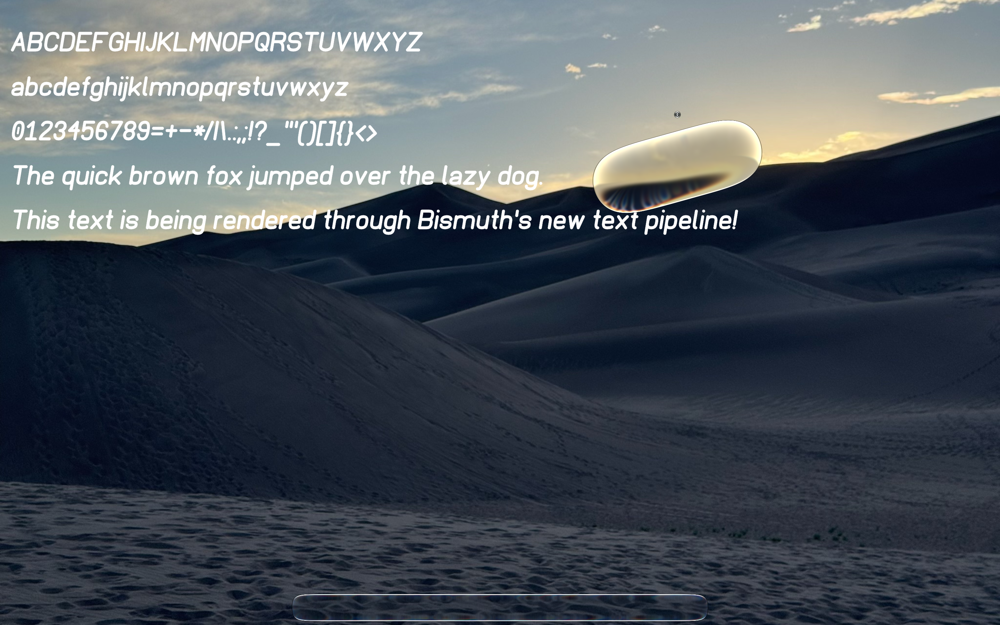
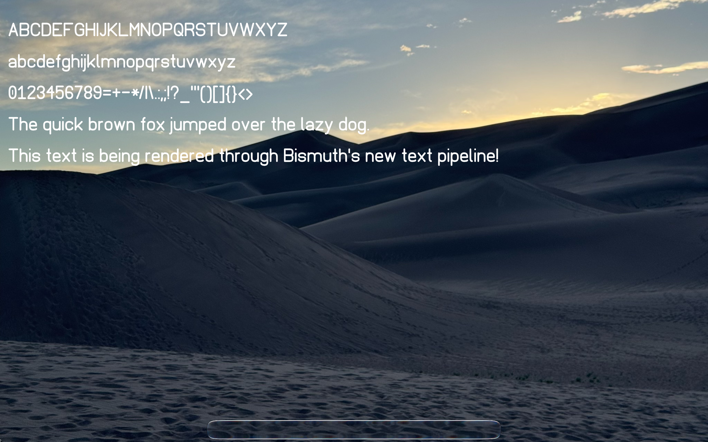

# bismuth-linux

This is a port of the Bismuth graphics service spec to Linux.

Demos:

[ISC License](./LICENSE)

Images are credited by an `attribution.md` file in the same directory.

Special thanks to Ky for the amazing wallpapers! [Their personal website](https://KyNorthstar.me/).
