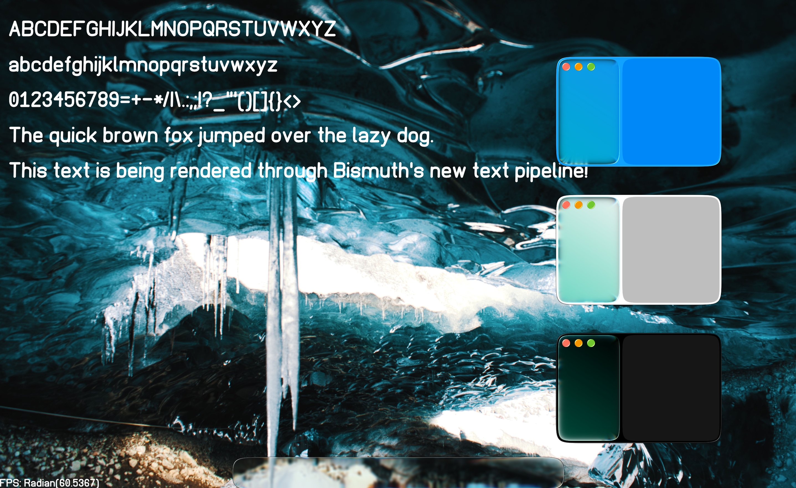

# bismuth-linux

Message Us on  or 

### Special thanks to

- Ky for the amazing wallpapers, tips and programming guidance! [Their personal website](https://KyNorthstar.me/).
- Konu for the amazing wallpapers.
- Pexels uploaders whose images We used (attribution lower).

### About

Bismuth will be a novel Desktop Environment for Linux distributions. Bismuth changes the usual ownership model and paint process of desktop UI, by hosting a live UI model on the "Graphics Service", where it can be quickly drawn, updated and evaluated by the Graphics Service and apps keep their window states in sync with the Server's state.

This allows safe use of true screen space effects, like glassy reflections/refractions, to be rendered with knowledge about the rest of the screen. This enables fancy effects like "Gliss", which is Our own adapted style of  WWDC25 Liquid Glass, with way rounder and edges that look like a real piece of curved glass.

Currently the desktop renders inside a GLWF window, but soon it will run on top of DRM as a standalone and fully integrated Desktop Evironment!

### Attributions

[See full list of attributions for used content](./attribution.md)

### Some more demo images

Redering Bismuth Fonts with variable boldness and slant, Gliss shape present:

Redering Bismuth Fonts wihout variability:

### License

[ISC License](./LICENSE)
